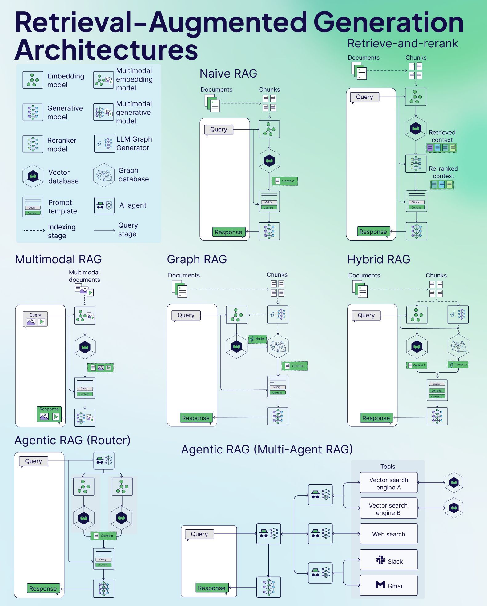

# Project Proposal: Domain-Specific Large Model Benchmarks for Edge-Oriented E-Government Services

## 1. Introduction
With the rapid adoption of AI in public sectors, domain-specific large language models (LLMs) are increasingly deployed at the edge for real-time, localized decision-making in e-government services. However, existing benchmarks predominantly focus on cloud-centric scenarios, lacking tailored evaluation frameworks for edge environments where data privacy, regional specificity, and resource constraints are critical. This project aims to address this gap by developing a **province-specific benchmark** for Chinese e-government LLMs using KubeEdge-Ianvs, integrating Retrieval-Augmented Generation (RAG) techniques to enhance contextual accuracy.

## 2. Objectives
1. Build a **multi-province knowledge repository** of Chinese e-government data for RAG-enhanced LLM benchmarking.
2. Design **two test modes**:
   - *Province-specific*: Answers generated using only local provincial data
   - *Cross-province*: Responses leveraging nationwide data
3. Implement and compare popular RAG architectures in Ianvs

## 3. Methodology
### 3.1 Data Collection & Processing
- **Sources**: 
  - Provincial government portals (e.g., Zhejiang "Zhejiang Ban")
  - Policy documents from 34 provincial-level regions
  - Localized service catalogs (social security, tax, etc.)
- **Data Processing**:
  - Search more data from the internet
  - Use LLM to augment the data
  - Text splitting with configurable chunk size and overlap
  - Document embedding using Hugging Face models
  - Vector storage in Chroma database

### 3.2 Benchmark Design
| Test Scenario | Knowledge Scope |
|---------------|-----------------|
| Local Policy QA | Single province data |
| Cross-region Service | All provinces |

### 3.3 RAG Implementation

Here is a architecture diagram of the RAG implementation to help you understand what is RAG:



Here we only use the native RAG implementation in Ianvs, however, other RAG implementations can be easily integrated into Ianvs in the similar way.

The RAG implementation leverages LangChain and includes:

- **Knowledge Base Management**
  - Automatic initialization and loading of vector store
  - Support for incremental updates to the knowledge base
  - Document change detection to avoid unnecessary reprocessing
  - Persistent storage of embeddings

- **Vector Store**
  - Chroma as the vector store backend
  - Efficient similarity search for relevant context
  - Automatic embedding generation using Hugging Face models

- **Retrieval Process**
  - Query-based document retrieval
  - Context integration into LLM prompts
  - Configurable retrieval parameters (k documents, chunk size)

## 4. Technical Implementation
### 4.1 System Architecture
The RAG system is integrated into the existing Ianvs framework with the following components:

1. **Document Processing Pipeline**
   - Text splitting with configurable chunk size and overlap
   - Document embedding using Hugging Face models
   - Vector storage in Chroma database

2. **Inference Pipeline**
   - Query analysis
   - Context retrieval from vector store
   - Context-enhanced prompt construction
   - LLM response generation

3. **Optimization Features**
   - Document hashing for change detection
   - Persistent vector store
   - Error handling and logging

### 4.2 Key Innovations
1. **Automatic Knowledge Base Management**
   - Self-initializing vector store
   - Incremental document processing
   - Hash-based change detection

2. **Edge-Optimized RAG**
   - Configurable embedding models
   - Persistent local storage
   - Resource-efficient retrieval

## 5. Expected Outcomes
1. **Ianvs Integration**
   - Fully integrated RAG capabilities in the benchmark
   - Comparative performance metrics with and without RAG

2. **Performance Guidelines**
   - Optimal configuration recommendations
   - Best practices for knowledge base management

## 6. Implementation Details

### 6.1 Configuration
Users can configure the RAG system by modifying the following parameters:
```python
# RAG配置
KNOWLEDGE_BASE_PATH = "/path/to/your/knowledge/base"  # 知识库文档路径
VECTOR_STORE_PATH = "/path/to/vector/store"  # 向量存储路径
EMBEDDING_MODEL = "sentence-transformers/all-MiniLM-L6-v2"  # 使用的embedding模型
```

### 6.2 Document Processing
Documents are processed using the following pipeline:
1. Text files are loaded from the knowledge base directory
2. Documents are split into chunks using CharacterTextSplitter
3. Chunks are embedded using the specified embedding model
4. Embeddings are stored in a Chroma vector store

### 6.3 Inference Process
During inference:
1. The user query is extracted from the input
2. Relevant context is retrieved from the vector store
3. Context is added to the system message
4. The LLM generates a response considering both the query and context

## 7. Timeline
| Phase | Dates | Deliverables |
|-------|-------|--------------|
| Data Collection | Mar 3-21 | Provincial knowledge corpus |
| RAG Integration | Mar 24-Apr 11 | 5 working prototypes |
| Benchmark Tests | Apr 14-May 2 | Cross-province evaluation |
| Optimization | May 5-23 | Performance tuning |
| Finalization | May 26-30 | Documentation & reports |
