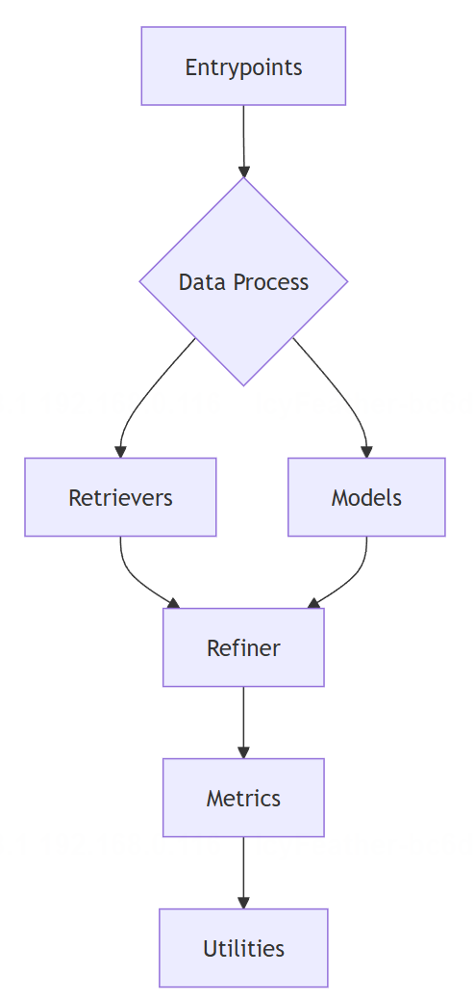

# Project Proposal: Domain-Specific Large Model Benchmarks for Edge-Oriented E-Government Services

## 1. Introduction
With the rapid development of large language models (LLMs), the demand for personalized, compliant, and real-time services has given rise to edge-based LLMs. Among these, the government affairs sector is a key area where edge models play a vital role. Government tasks require a high level of data privacy and the ability to respond in real time, making edge deployment an ideal solution.

However, existing benchmarks mostly focus on general capabilities or specific academic tasks, lacking comprehensive datasets for evaluating LLMs in domain-specific scenarios such as Chinese government affairs. To fill this gap, we previously proposed the Chinese Government Affairs Understanding Evaluation Benchmark (CGAUE). This benchmark provides an open, community-driven evaluation framework to assess both the objective and subjective capabilities of LLMs and has been tested with commonly used LLMs in Ianvs.

Yet, there is still room for improvement in our previous work. We directly called upon LLMs without fine-tuning or implementing Retrieval-Augmented Generation (RAG). Moreover, most existing LLMs have not been extensively trained on government data. Additionally, government data updates rapidly, while LLMs do not acquire new knowledge after their training is completed. This results in subpar performance of LLMs on government data. Addressing this issue is the goal of our current work.

## 2. Motivation
### 2.1 Previous Research and Experimentation
Previous research has shown that existing LLMs, when deployed without edge-specific optimizations, face significant challenges in handling domain-specific tasks in Chinese government affairs. For instance, models like GPT-4, which have not been trained on specialized government data, often exhibit poor performance in tasks such as policy interpretation and citizen service inquiries. These models frequently produce inaccurate or irrelevant responses due to the lack of domain-specific knowledge and the inability to access localized data in real-time.

### 2.2 Need for Edge Deployment in Government Affairs
The deployment of LLMs at the edge for Chinese government affairs is driven by several critical factors:

- **Market Size and Adoption**: The market for AI-driven government affairs solutions in China is rapidly expanding, with estimates projecting it to reach $15 billion by 2025. This growth is fueled by the increasing adoption of AI and edge computing in public administration.
- **Case Studies**: Several cities in China have already implemented edge-based LLMs to enhance their government services. For example, Shenzhen has deployed an edge-based LLM to streamline citizen inquiries and policy dissemination, significantly improving the efficiency of public services. Guangzhou has integrated an edge LLM into its smart city infrastructure to provide localized responses to citizen inquiries, ensuring accurate and context-aware responses.
- **Data Sensitivity and Compliance**: Government data involves sensitive information (e.g., social security, personal privacy), which requires localized processing to prevent data leakage and ensure compliance with legal regulations.
- **Low Latency Requirements**: Government services need real-time responses, such as providing policy details or handling citizen inquiries. Edge models offer faster responses compared to cloud-based solutions.
- **Localized Knowledge**: Government regulations vary significantly across regions. Edge deployment allows LLMs to adapt to local policies and respond accurately to location-specific inquiries.

### 2.3 Rationale for Using RAG
Given the need for localized, real-time, and compliant processing of government data, the use of Retrieval-Augmented Generation (RAG) is essential. RAG enhances the capabilities of LLMs by integrating external knowledge sources, ensuring that models can access the most relevant and up-to-date information specific to each region. This approach is particularly beneficial for edge deployment, where models need to operate with local data to maintain privacy and reduce latency.

## 3. Objectives
1. Build a **multi-province knowledge repository** of Chinese e-government data for RAG-enhanced LLM benchmarking.
2. Design **two test modes**:
   - *Province-specific*: Answers generated using only local provincial data.
   - *Cross-province*: Responses leveraging nationwide data.
3. Implement and compare popular RAG architectures in Ianvs.

## 4. Methodology
### 4.1 Data Collection & Processing
- **Sources**:
  - Provincial government portals (e.g., Zhejiang "Zhejiang Ban")
  - Policy documents from 34 provincial-level regions
  - Localized service catalogs (social security, tax, etc.)
- **Data Processing**:
  - Search more data from the internet.
  - Use LLM to augment the data.
  - Text splitting with configurable chunk size and overlap.
  - Document embedding using Hugging Face models.
  - Vector storage in Chroma database.

### 4.2 Benchmark Design
| Test Scenario | Knowledge Scope |
|---------------|-----------------|
| Local Policy QA | Single province data |
| Cross-region Service | All provinces |

### 4.3 RAG Implementation
Here is an architecture diagram of the RAG implementation to help you understand what is RAG:



Here we only use the native RAG implementation in Ianvs, however, other RAG implementations can be easily integrated into Ianvs in the similar way.

The RAG implementation leverages LangChain and includes:

- **Knowledge Base Management**
  - Automatic initialization and loading of vector store.
  - Support for incremental updates to the knowledge base.
  - Document change detection to avoid unnecessary reprocessing.
  - Persistent storage of embeddings.

- **Vector Store**
  - Chroma as the vector store backend.
  - Efficient similarity search for relevant context.
  - Automatic embedding generation using Hugging Face models.

- **Retrieval Process**
  - Query-based document retrieval.
  - Context integration into LLM prompts.
  - Configurable retrieval parameters (k documents, chunk size).

## 5. Technical Implementation
### 5.1 System Architecture
The RAG system is integrated into the existing Ianvs framework with the following components:

1. **Document Processing Pipeline**
   - Text splitting with configurable chunk size and overlap.
   - Document embedding using Hugging Face models.
   - Vector storage in Chroma database.

2. **Inference Pipeline**
   - Query analysis.
   - Context retrieval from vector store.
   - Context-enhanced prompt construction.
   - LLM response generation.

3. **Optimization Features**
   - Document hashing for change detection.
   - Persistent vector store.
   - Error handling and logging.

### 5.2 Key Innovations
1. **Automatic Knowledge Base Management**
   - Self-initializing vector store.
   - Incremental document processing.
   - Hash-based change detection.

2. **Edge-Optimized RAG**
   - Configurable embedding models.
   - Persistent local storage.
   - Resource-efficient retrieval.

### 5.3 Incremental Knowledge Base Updates
To ensure the knowledge base remains up-to-date and efficient, we implement incremental updates using the following strategies:

#### Hash Fingerprint Calculation
At the beginning of each processing cycle, calculate the hash fingerprint for each chunk. This unique value is generated based on the content and metadata of the chunk using a hash function.

#### Tracking Mechanism
Implement a mechanism to track and store information about each processed chunk, including source document, chunk information, hash fingerprint, and timestamp. Tools like LangChain's RecordManager or LlamaIndex's DocumentStore can be used.

#### Incremental Update Process
During each incremental update, compare the hash fingerprint with the previously saved processing information to determine the action for each data chunk:
- **Skip**: If a data chunk's hash fingerprint exists in the previous processing, skip it.
- **Add**: If a data chunk's hash fingerprint does not exist in the previous processing, perform an addition.
- **Delete**: For hash fingerprints that existed in the previous processing but are missing in the current one, perform a deletion.

#### Embedding and Indexing Updates
Perform the corresponding embedding and indexing updates on the data chunks based on the determined actions. This may require certain capabilities from the vector database to support incremental index updates.

By leveraging these strategies, unnecessary computational workload can be reduced, potential duplicate chunks and indexes can be eliminated, model usage costs can be saved, and the effectiveness and accuracy of the subsequent retrieval phase in RAG applications can be improved.

## 6. Expected Outcomes
1. **Ianvs Integration**
   - Fully integrated RAG capabilities in the benchmark.
   - Comparative performance metrics with and without RAG.

2. **Performance Guidelines**
   - Optimal configuration recommendations.
   - Best practices for knowledge base management.

## 7. Implementation Details

### 7.1 Configuration
Users can configure the RAG system by modifying the following parameters:
```python
# RAG Configuration
KNOWLEDGE_BASE_PATH = "/path/to/your/knowledge/base"  # Knowledge base document path
VECTOR_STORE_PATH = "/path/to/vector/store"  # Vector store path
EMBEDDING_MODEL = "sentence-transformers/all-MiniLM-L6-v2"  # Embedding model used
```

### 7.2 Document Processing
Documents are processed using the following pipeline:
1. Text files are loaded from the knowledge base directory.
2. Documents are split into chunks using CharacterTextSplitter.
3. Chunks are embedded using the specified embedding model.
4. Embeddings are stored in a Chroma vector store.

### 7.3 Inference Process
During inference:
1. The user query is extracted from the input.
2. Relevant context is retrieved from the vector store.
3. Context is added to the system message.
4. The LLM generates a response considering both the query and context.

## 8. Timeline
| Phase | Dates | Deliverables |
|-------|-------|--------------|
| Data Collection | Mar 3-21 | Provincial knowledge corpus |
| RAG Integration | Mar 24-Apr 11 | 5 working prototypes |
| Benchmark Tests | Apr 14-May 2 | Cross-province evaluation |
| Optimization | May 5-23 | Performance tuning |
| Finalization | May 26-30 | Documentation & reports |
